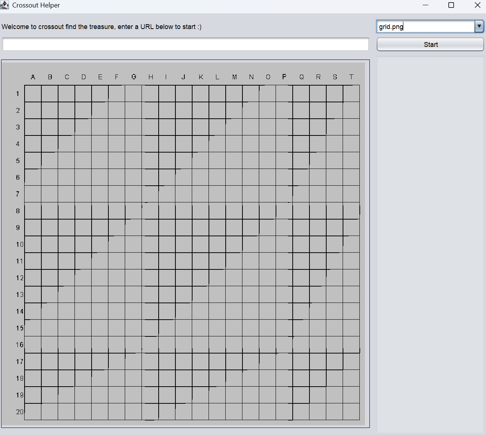

# Welcome to Crossout find the treasure helper

Tired of looking through the Steam comments for the find the treasure contests every 3 months to see if 2 specific coordinates haven't been picked yet? 
That's why I'm making this project, so far prints all sorted coordinates to a text file and makes a grid to see which spaces are free. 
Future plans include a UI/jar file release. The UI is mostly done, so jar release maybe soon TM.

## Current UI preview:

Also, why Java? Because I can.
